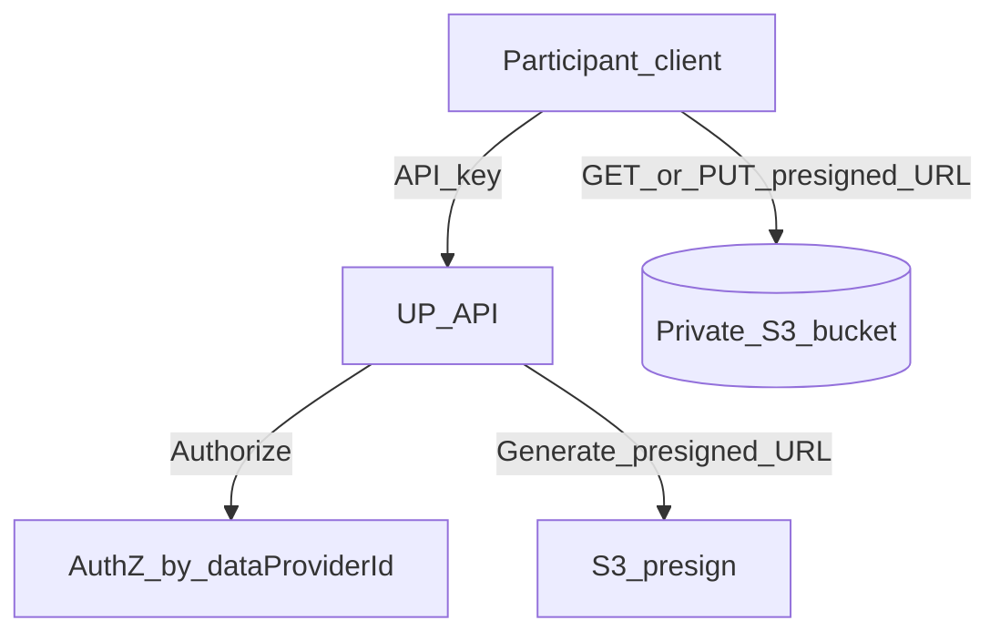
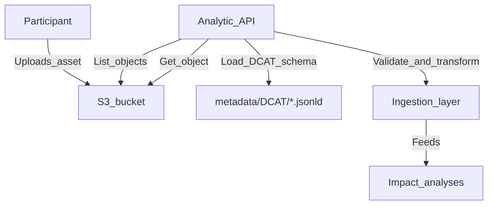

# ONDAs Data Space — Especificación de assets (datasets) en S3

Este documento define **cómo deben subir los participantes** los datasets al Data Space para que Universal Plastic (UP) los pueda **descargar, validar e ingerir** desde la API analítica.

## Principios

- **Assets en S3**: todos los assets se guardan en S3 bajo un prefijo estándar y en formato JSON (o variantes como NDJSON).
- **Metadatos públicos (DCAT JSON-LD)**: UP publica los esquemas/plantillas que definen cada tipo de dataset en `metadata/DCAT/` (DCAT 2 en JSON-LD).
- **Un asset = metadatos + dataset**: el fichero que sube el participante **incluye primero metadatos del asset** y luego el **dataset** para que la API analítica pueda entender “qué es” y “cómo leerlo”.

## Importante: DCAT público (esquema) vs metadatos de instancia (participante)

En este Data Space distinguimos:

- **DCAT público en `metadata/DCAT/*.jsonld`**: actúa como **esquema canónico por `datasetType`** (diccionario de columnas/variables en `schema:variableMeasured`). No debe “hardcodear” el publisher/contact/licencia/espacio/tiempo del dataset concreto de un participante.
- **Metadatos de instancia (del dataset anual del participante)**: se envían en `asset.metadata` dentro del JSON anual en S3 (p.ej. `publisher`, `contactPoint`, `license`, `rights`, `spatial`, `temporal`, `issued`, etc.). UP usa esos metadatos para catálogo/filtrado y para construir (si hace falta) una vista DCAT “instanciada” por participante y año.

## Tipos de dataset soportados (datasetType) y mapeo a DCAT

El campo `metadata.datasetType` del asset debe ser **uno de los siguientes identificadores de negocio** (canónicos). Cada uno mapea 1:1 a un esquema DCAT en `metadata/DCAT/`, que actúa como **diccionario de variables/columnas**.


| datasetType (canónico)           | DCAT JSON-LD de referencia                            |
| -------------------------------- | ----------------------------------------------------- |
| `boya_biomasa_slx+`              | `metadata/DCAT/boya_biomasa_slx+.jsonld`              |
| `boya_microplasticos_seabot`     | `metadata/DCAT/boya_microplasticos_seabot.jsonld`     |
| `meteorología_cdse_vl`           | `metadata/DCAT/meteorología_cdse_vl.jsonld`           |
| `muestras_de_agua_py_gcms`       | `metadata/DCAT/muestras_de_agua_py_gcms.jsonld`       |
| `muestras_de_peces_py_gcms`      | `metadata/DCAT/muestras_de_peces_py_gcms.jsonld`      |
| `recogidas_plastico_app_up_v700` | `metadata/DCAT/recogidas_plastico_app_up_v700.jsonld` |


Notas:

- El DCAT define las variables en `schema:variableMeasured[]` (cada entrada corresponde a una columna/campo esperado).
- En el DCAT actual, la semántica de tipo/unidad/escala se codifica en `schema:description` como texto `clave=valor; clave=valor; ...` (generado por `metadata/DCAT/generate_dcat.py`).

## Estructura de carpetas en S3 (key/prefix)

Los datasets representan un **dataset anual**. Además, `assetId` se obtiene **a posteriori** de subir el dataset a S3 (no se puede usar para construir el path). Por tanto, hay **un único asset anual por `dataProviderId` y `datasetType`**.

Convención recomendada para la key en S3:

```
datasets/<localizacion>/<dataProviderId>/<datasetType>/<schemaVersion>/<YYYY>.json
```

Ejemplo:

```
datasets/barcelona/innoceana/recogidas_plastico_app_up_v700/v1/2026.json
```

Campos clave:

- `**dataProviderId**`: slug estable del participante (minúsculas, sin espacios; p.ej. `innoceana`, `bcss`, `portbadalona`).
- `**datasetType**`: uno de los 6 anteriores.
- `**schemaVersion**`: versión del contrato del asset (p.ej. `v1`). Cambia solo si cambia el formato del asset (no el contenido del dataset).
- `**YYYY**`: año del dataset anual (p.ej. `2026`).

## Autorización de acceso a S3 (bucket privado + presigned URLs)

El bucket S3 de datasets será **privado**. No se usará acceso público ni “API keys” custom en headers directamente contra S3 (S3 no valida `x-api-key` de forma nativa).

El control de acceso se implementa así:

- **API key por participante**: cada participante dispone de una **API key** para autenticarse contra la **API de UP**.
- **La API de UP autoriza y genera URLs prefirmadas** (presigned URLs) para objetos concretos en S3:
  - **Presigned GET**: para descargar `datasets/<dataProviderId>/<datasetType>/<schemaVersion>/<YYYY>.json`
  - **Presigned PUT**: para subir/reemplazar el asset anual
- **El cliente accede a S3 usando la URL prefirmada** (sin credenciales AWS).

Flujo resumido:




## Formato del asset (JSON): `metadata` + `dataset`

El asset que se sube a S3 debe seguir este contenedor:

```json
{
  "metadata": { },
  "dataset": { }
}
```

### `metadata` (mínimo común)

`metadata` es el bloque que permite a UP:

- identificar el tipo de dataset (`datasetType`)
- localizar el esquema público DCAT (`dcatSchemaRef`)
- validar y trazar el origen (`dataProviderId`, `createdAt`, `assetId`, etc.)

Campos mínimos (v1):

- `**schemaVersion**`: string, p.ej. `"v1"`.
- `**datasetType**`: string (uno de los 6).
- `**dataProviderId**`: string (slug).
- `**dcatSchemaRef**`: string (ruta relativa al repo o un URI/URN estable), p.ej. `"metadata/DCAT/boya_biomasa_slx+.jsonld"`.
- `**createdAt**`: string ISO 8601 (UTC recomendado), p.ej. `"2026-05-04T13:34:00.000Z"`.
- `**year**`: number (año del dataset anual, p.ej. `2026`).
- `**dateRange**` *(opcional)*: `{ "start": "YYYY-MM-DD", "end": "YYYY-MM-DD" }` (si dentro del año solo hay una ventana parcial).
- `**location*`* *(opcional según tipo)*: `{ "lat": number, "lon": number }` o `null`.
- `**recordCount*`* *(opcional pero recomendado)*: number (si el dataset es tabular/filas).
- `**checksum*`* *(opcional)*: `{ "algo": "sha256", "value": "<hex>" }`.
- `**fieldsIncluded*`* *(opcional)*: `string[]` (si el asset sube solo un subset de columnas del DCAT; ver Validación).
- `**allowExtraFields*`* *(opcional)*: boolean (por defecto `false`).

Campos opcionales típicos:

- `source`: información de procedencia (instrumento, laboratorio, app versión, etc.)
- `license`: si el asset necesita especificar licencia adicional a la del DCAT
- `**units**` *(opcional)*: objeto `{ "<fieldName>": "<unitString>" }` que declara explícitamente las unidades de las variables numéricas del dataset. Las unidades canónicas se definen en `schema:unitText` del DCAT asociado; este campo permite confirmarlas o documentar desviaciones a nivel de instancia.

### `dataset` — 3 formatos admitidos

El bloque `dataset` puede representarse de 3 maneras. El productor elige **una** y la especifica en `dataset.format`.

#### Opción A — Array de filas (`rows`)

Recomendado para volúmenes pequeños/medios o pilotos.

```json
{
  "metadata": {
    "schemaVersion": "v1",
    "datasetType": "muestras_de_agua_py_gcms",
    "dataProviderId": "universalplastic",
    "dcatSchemaRef": "metadata/DCAT/muestras_de_agua_py_gcms.jsonld",
    "createdAt": "2026-05-04T13:34:00.000Z",
    "year": 2026,
    "dateRange": { "start": "2026-02-18", "end": "2026-03-07" },
    "location": { "lat": 41.434212, "lon": 2.243317 },
    "recordCount": 2,
    "license": "https://creativecommons.org/licenses/by/4.0/",
    "units": {
      "Polyethylene": "μg L⁻¹",
      "Polypropylene": "μg L⁻¹",
      "Polystyrene": "μg L⁻¹",
      "Polyvinyl chloride": "μg L⁻¹",
      "Polyethylene terephthalate": "μg L⁻¹",
      "Polyamide": "μg L⁻¹",
      "Polycarbonate": "μg L⁻¹",
      "Polyurethane": "μg L⁻¹",
      "Poly(methyl methacrylate)": "μg L⁻¹",
      "Acrylonitrile-butadiene-styrene": "μg L⁻¹",
      "Polyvinyl acetate": "μg L⁻¹",
      "Polyvinyl alcohol": "μg L⁻¹"
    }
  },
  "dataset": {
    "format": "rows",
    "records": [
      {
        "Date": "2026-02-18",
        "Polyethylene": 1.842,
        "Polypropylene": 0.931,
        "Polystyrene": 0.374,
        "Polyvinyl chloride": null,
        "Polyethylene terephthalate": 0.618,
        "Polyamide": null,
        "Polycarbonate": null,
        "Polyurethane": 0.205,
        "Poly(methyl methacrylate)": null,
        "Acrylonitrile-butadiene-styrene": null,
        "Polyvinyl acetate": null,
        "Polyvinyl alcohol": null
      },
      {
        "Date": "2026-02-19",
        "Polyethylene": 2.103,
        "Polypropylene": 1.047,
        "Polystyrene": 0.289,
        "Polyvinyl chloride": null,
        "Polyethylene terephthalate": 0.572,
        "Polyamide": 0.134,
        "Polycarbonate": null,
        "Polyurethane": null,
        "Poly(methyl methacrylate)": null,
        "Acrylonitrile-butadiene-styrene": null,
        "Polyvinyl acetate": null,
        "Polyvinyl alcohol": null
      }
    ]
  }
}
```

Notas:

- Cada objeto en `records[]` representa una observación (“fila”).
- Las keys de cada fila deben corresponder a `schema:variableMeasured[].schema:name` del DCAT asociado.

#### Opción B — NDJSON (línea a línea)

Recomendado para volúmenes grandes y/o ingestión streaming. Hay 2 variantes.

##### Variante B1 (recomendada): 2 ficheros por asset

En S3:

- `.../<assetId>.meta.json` contiene:

```json
{
  "metadata": {
    "schemaVersion": "v1",
    "datasetType": "recogidas_plastico_app_up_v700",
    "dataProviderId": "innoceana",
    "dcatSchemaRef": "metadata/DCAT/recogidas_plastico_app_up_v700.jsonld",
    "createdAt": "2026-05-04T13:34:00.000Z",
    "year": 2026,
    "dateRange": { "start": "2026-01-15", "end": "2026-11-07" },
    "units": {
      "Plastic waste collected": "kg",
      "Walking distance": "km",
      "Cleanup duration": "s",
      "Polyethylene terephthalate": "%",
      "Polypropylene": "%"
    }
  },
  "dataset": { "format": "ndjson", "ndjsonRef": "./2026.ndjson" }
}
```

- `.../<assetId>.ndjson` contiene (una fila por línea):

```json
{"Date":"2026-05-01","Start point":[41.375547,2.190546],"End point":[41.375600,2.190700],"Plastic waste collected":12.3}
{"Date":"2026-05-03","Start point":[41.375100,2.189900],"End point":[41.375300,2.190100],"Plastic waste collected":4.1}
```

##### Variante B2: 1 fichero híbrido (menos recomendable)

En un solo fichero: primera línea con metadata y el resto líneas con filas NDJSON. Solo usar si no se permite multi-objeto por asset.

#### Opción C — Columnar JSON (`columnar`)

Recomendado cuando el productor controla bien el formato y el consumo es principalmente analítico/series temporales.

```json
{
  "metadata": {
    "schemaVersion": "v1",
    "datasetType": "meteorología_cdse_vl",
    "dataProviderId": "universalplastic",
    "dcatSchemaRef": "metadata/DCAT/meteorología_cdse_vl.jsonld",
    "createdAt": "2026-05-04T13:34:00.000Z",
    "year": 2026,
    "dateRange": { "start": "2026-02-18", "end": "2026-03-07" },
    "location": { "lat": 41.434212, "lon": 2.243317 },
    "units": {
      "Wind speed at 2m": "km/h",
      "Sea surface water temperature": "°C"
    }
  },
  "dataset": {
    "format": "columnar",
    "index": ["Date", "Time"],
    "columns": {
      "Date": ["2026-02-18", "2026-02-18"],
      "Time": ["00:00:00", "01:00:00"],
      "Wind speed at 2m": [12.4, 11.8],
      "Sea surface water temperature": [14.1, 14.0]
    }
  }
}
```

Reglas mínimas de columnar:

- Todas las columnas deben tener la **misma longitud**.
- `index[]` indica las columnas que identifican la fila lógica (p.ej. fecha/hora).

## Especificación por tipo (qué debe incluir el dataset)

Para cada `datasetType`, el conjunto de campos (columnas) permitido/esperado se define en su DCAT asociado:

- `schema:variableMeasured[].schema:name` define el nombre de campo.
- `schema:variableMeasured[].schema:description` codifica restricciones (tipo, unidad, encoding, escala, códigos de polímero, etc.).

En este estándar, el dataset subido por participantes debe cumplir:

- **Campos base obligatorios**: todos los campos del DCAT que sean *claves de indexación* (p.ej. `Date`, `Time` si existen).
- **Campos de medida**: se recomienda incluir **todas** las variables de medida del DCAT; si se omiten, deben ir como `null` o se documenta el subset en `metadata.fieldsIncluded` (ver Validación).

## Validación (contrato mínimo)

La API analítica validará un asset en 3 fases:

1. **Validación de contenedor**

- existe `metadata` y `dataset`
- `metadata.schemaVersion === "v1"`
- `metadata.datasetType` está en la lista soportada
- `metadata.dcatSchemaRef` corresponde al DCAT esperado para el `datasetType`
- `dataset.format` está en `{ "rows", "ndjson", "columnar" }`

1. **Validación contra DCAT**

- se carga el DCAT referenciado
- se extrae el conjunto de variables `V = { schema:name }`
- se verifica que el dataset no contiene campos desconocidos:
  - por defecto: **rechazar** si hay columnas fuera de `V`
  - si `metadata.allowExtraFields=true`: se permiten columnas extra pero **no** se usarán en análisis salvo soporte explícito
- política de columnas:
  - si `metadata.fieldsIncluded` está presente: el dataset debe contener **solo** esas columnas (más las de indexación si aplican), y todas deben estar en `V`
  - si `metadata.fieldsIncluded` NO está presente: se recomienda enviar todas las columnas del DCAT; si faltan, se aceptan si están como `null` (cuando el formato lo permita) o si el tipo no aplica ciertas medidas

1. **Validación de tipos/formato (best-effort)**

- se interpreta `schema:description` como pares `clave=valor` separados por `;`
- reglas recomendadas:
  - `value_type=iso8601` → string ISO (fecha u hora según campo)
  - `value_type=float|int` → number
  - `value_type=geo_point` con `encoding=lat_lon_array` → array `[lat, lon]` de números
  - `unit=...` y `dimension=...` se tratan como metadatos de coherencia (no bloqueantes salvo que se indique)

### Normalización recomendada (para interoperabilidad)

- **Fechas**: `YYYY-MM-DD` (UTC day). Campo típico: `Date`.
- **Horas**: `HH:MM:SS` (24h). Campo típico: `Time`.
- **Geopuntos**:
  - si el DCAT define `encoding=lat_lon_array`: usar array `[lat, lon]` (números en EPSG:4326).
  - si además se incluye `metadata.location`, debe ser coherente con los registros (si existen).
- **Nulos**:
  - valores faltantes deben representarse como `null` (en `rows` o `columnar`).
  - en NDJSON, una key omitida se interpreta como `null` (pero se recomienda mantener keys consistentes).

### Límites operativos (recomendados)

Para evitar payloads demasiado grandes:

- `rows`: recomendado hasta ~50k filas por asset.
- `ndjson`: recomendado para >50k filas (streaming).
- `columnar`: recomendado para series temporales o consumos analíticos con columnas densas.

## Flujo de ingesta (alto nivel)




### Contratos mínimos para la API analítica (para poder ingerir)

Este estándar asume que la API analítica implementará (o expondrá internamente) estas capacidades:

- **Listar assets**: listar objetos bajo `datasets/<dataProviderId>/<datasetType>/...` (o buscar por prefijo).
- **Resolver el “asset principal”**:
  - `rows|columnar`: el propio `<assetId>.json` contiene `metadata` y `dataset`.
  - `ndjson` (B1): `<assetId>.meta.json` contiene `metadata` y la referencia a `<assetId>.ndjson`.
- **Descargar y parsear**:
  - `rows|columnar`: parseo JSON clásico.
  - `ndjson`: lectura streaming línea a línea.
- **Validar vs DCAT**: cargar el DCAT indicado por `metadata.dcatSchemaRef` y aplicar las reglas de la sección Validación.
- **Transformar a representación interna**: normalizar a una estructura tabular interna (p.ej. array de filas) o a la forma requerida por el motor de análisis/plots.

### Transformación recomendada (normal form)

Para simplificar downstream, la ingesta puede transformar cualquier formato a “normal form”:

- `rows` → se usa tal cual.
- `ndjson` → se stream-procesa y se va construyendo una salida tabular (o se procesa por ventanas).
- `columnar` → se “despivot” a filas usando `dataset.index` + `dataset.columns`.

### Relación con S3 en el repo actual

Actualmente la API usa S3 para exportar outputs (plots) en `src/api-v1/analyses/analyses-s3.ts`.
La ingesta de datasets de participantes reutiliza el mismo patrón conceptual (S3 client, get/list objects), pero apuntando al prefijo `datasets/` en lugar de `plots/`.

## Checklist para participantes

- Elegir `datasetType` correcto (uno de los 6).
- Descargar y revisar el DCAT asociado en `metadata/DCAT/`.
- Generar el asset con:
  - `metadata` completo (mínimo común)
  - `dataset` en uno de los 3 formatos admitidos
- Subirlo a S3 respetando el prefix estándar.

